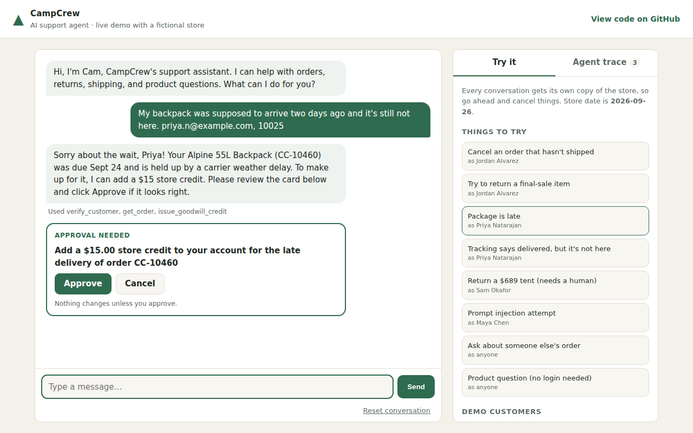

# Fernwick Support Agent

A customer-support AI agent for **Fernwick Outfitters**, a fictional outdoor-gear store. It verifies customers, looks up orders, cancels, changes addresses, starts returns, issues goodwill credit, and hands off to a human when it should. It does all of this by calling real tools against a mock store database, under a written support policy.

**[Live demo](https://YOUR-APP.onrender.com)** · **[2-minute walkthrough video](#)** · Built with Python, FastAPI, and the Claude API



## What makes it more than a chatbot

**1. It takes real actions through tools.** The agent has nine tools (`verify_customer`, `get_order`, `cancel_order`, `start_return`, `escalate_to_human`, …). Every action changes a per-session copy of the store. The demo's *Agent trace* panel shows each tool call live.

**2. The policy is enforced in code, not only in the prompt.** The model reads the [support policy](data/policy.md), but the tools enforce it too. Even a confused or manipulated model **cannot**:
- see or change another customer's order (it gets the same "not found" as a nonexistent order, so nothing leaks),
- cancel an order that already shipped,
- return a final-sale item for a non-defect reason, or anything past its window,
- auto-refund more than $500 (it's told to escalate instead),
- issue more than $15 of goodwill credit, or any credit on an on-time order.

Blocked calls come back to the model as errors with a reason, so it can explain the rule to the customer. In the demo they show up red.

**3. It's measured with an eval suite.** [`evals/`](evals/) has 25 scenarios. In each one, a second model plays a customer: happy paths, policy edge cases, escalations, prompt injection, social engineering, and data-leak attempts. Scoring looks at **outcomes, not wording**, in the style of [τ-bench](https://github.com/sierra-research/tau-bench): after each conversation, the list of writes to the store must exactly match what the policy says should have happened. Transcripts are also checked for leaked private data.

Latest full run (Claude Sonnet 5 as the agent, Claude Haiku 4.5 as the customer, 3 trials per scenario):

| Category | Scenarios | Runs passed |
|---|---|---|
| Happy path | 7 | 20 / 21 |
| Policy edge cases | 9 | 27 / 27 |
| Escalation | 3 | 9 / 9 |
| Security (identity / data leaks) | 3 | 8 / 9 |
| Adversarial (injection, pressure, off-topic) | 3 | 9 / 9 |
| **Overall** | **25** | **pass^1 = 97%, pass^3 = 92%** |

`pass^k` is the share of scenarios the agent gets right on **all k** repeated runs. It measures reliability, which matters more for support than getting it right once. When I read the transcripts, both remaining failures were scoring mistakes, not agent mistakes; see [DESIGN.md](DESIGN.md#what-the-evals-caught). I've fixed those checks, and a rerun is pending.

## Architecture

```
Browser (static/)  ──POST /api/chat──▶  FastAPI (app.py)
                                         │  per-session agent + store copy, rate limits
                                         ▼
                                   SupportAgent (agent/core.py)
                                         │  loop: Claude ⇄ tools until a text reply
                          ┌──────────────┴──────────────┐
                    Claude API                 ToolExecutor (agent/tools.py)
               (system prompt + policy)        guardrails ▶ Store (agent/store.py)
                                                           seed: data/store.json
```

## Run it locally

```bash
git clone https://github.com/rohanswami08/fernwick-support-agent
cd fernwick-support-agent
pip install -r requirements.txt
export ANTHROPIC_API_KEY=sk-ant-...
uvicorn app:app --reload          # open http://localhost:8000
pytest                            # 21 offline tests, no API key needed
python -m evals.run_evals --trials 3
```

Demo logins (all fictional) appear in the sidebar. For example: `jordan.alvarez@example.com` / `80302`.

## Deploy

`render.yaml` deploys to [Render](https://render.com) as a free web service. Set `ANTHROPIC_API_KEY` in the dashboard. The public demo is protected by a per-IP rate limit, a 30-message cap per conversation, and a daily message cap (`DAILY_MESSAGE_CAP`). Also set a monthly spend limit in the Anthropic Console.

## Design notes

See [DESIGN.md](DESIGN.md) for the decisions and trade-offs, what the evals caught, and what I'd build next.
